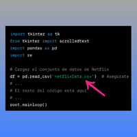

# Sistema de Recomendación de Netflix 🍿

¡Hola, soy Ferran226! 😄 ¿Alguna vez te has sentido abrumado por la cantidad infinita de películas y series disponibles en Netflix? No te preocupes, estoy aquí para ayudarte. He creado este Sistema de Recomendación de Netflix para hacer que tu experiencia de búsqueda y descubrimiento sea mucho más emocionante y personalizada. 🎬

## ¿Qué hace este sistema? 🤔

Este sistema se basa en la idea de ayudarte a encontrar nuevas películas y series para ver, ¡basadas en tus gustos y preferencias! ¿Cómo funciona? ¡Es súper fácil! 😎

1. **Ingresa una película o serie que te haya encantado en Netflix**: Simplemente escribe el nombre en el campo de entrada. 📺

2. Haz clic en el botón "Obtener Recomendaciones" y espera un momento mientras realizo una búsqueda mágica en mi base de datos. 🪄

3. ¡Voilà! Te mostraré una lista de películas que podrían interesarte. 🎉

4. ¿Necesitas borrar tus selecciones? ¡No hay problema! Utiliza el botón "Limpiar" y comienza de nuevo. 🧹

## ¿Cómo funciona este sistema mágico? ✨

- 🎯 **Búsqueda Inteligente**: Mi sistema no se limita a buscar películas que simplemente se parezcan a la que ingreses. Voy más allá y considero detalles como el director, los actores y el género para ofrecerte recomendaciones más personalizadas.

- 📽️ **Variedad de Opciones**: No te ofreceré solo una película; te proporcionaré una lista de recomendaciones, ¡porque la variedad es la clave para encontrar algo realmente emocionante!

- 🤩 **Explora sin Esfuerzo**: Deja de perder tiempo buscando en Netflix. Con solo unos pocos clics, tendrás una lista de películas que ni siquiera sabías que necesitabas en tu vida.

- 📋 **Resultados Claros**: Los resultados se mostrarán en la ventana de resultados con una opción de desplazamiento, para que no te pierdas ninguna de las sugerencias. 📜

## Instrucciones para Comenzar 🚀

Asegúrate de que el archivo 'netflixData.csv' esté en la misma ubicación que este programa. Si no, asegúrate de que el nombre del archivo sea correcto en el código. ¡Es la llave mágica que me permite encontrar tus recomendaciones!

## Detalles Técnicos 👨‍💻

Este programa utiliza la biblioteca tkinter para crear una interfaz de usuario amigable y pandas para gestionar y buscar en el conjunto de datos de Netflix. Aquí tienes una muestra de cómo se ve el código:

## Agradecimiento y Soporte 🙌

¡Gracias por elegir nuestro Sistema de Recomendación de Netflix! Esperamos que disfrutes explorando una gran variedad de películas y series emocionantes. 🍿✨

Si tienes alguna pregunta, sugerencia, o simplemente deseas saludar, ¡no dudes en ponerte en contacto! Estamos aquí para ayudarte en tu búsqueda de entretenimiento. ¡Disfruta de tu tiempo viendo películas y series en Netflix! 🌟📺😊

