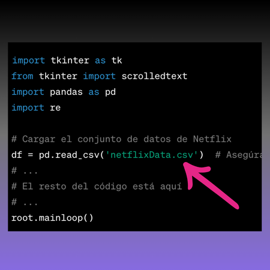

# 🇺🇸 Netflix Recommendation System 🍿

Hello, I'm Ferran226! 😄 Have you ever felt overwhelmed by the endless array of movies and series available on Netflix? Don't worry; I'm here to assist you. I've created this Netflix Recommendation System to make your search and discovery experience much more exciting and personalized. 🎬

## What does this system do? 🤔

This system is designed to help you discover new movies and series to watch, based on your tastes and preferences! How does it work? It's super easy! 😎

1. **Enter a movie or series you loved on Netflix**: Simply type the name in the input field. 📺

2. Click the "Get Recommendations" button and wait a moment as I perform a magical search in my database. 🪄

3. Voilà! I'll show you a list of movies that might interest you. 🎉

4. Need to clear your selections? No problem! Use the "Clear" button and start over. 🧹

## How does this magical system work? ✨

- 🎯 **Smart Search**: My system goes beyond just finding movies that resemble what you enter. I consider details like the director, actors, and genre to provide more personalized recommendations.

- 📽️ **Variety of Options**: I won't offer you just one movie; I'll provide you with a list of recommendations because variety is the key to finding something truly exciting!

- 🤩 **Effortless Exploration**: Stop wasting time searching on Netflix. With just a few clicks, you'll have a list of movies you didn't even know you needed in your life.

- 📋 **Clear Results**: Results will be displayed in the results window with a scrolling option, so you won't miss any of the suggestions. 📜

## Getting Started Instructions 🚀

Make sure the 'netflixData.csv' file is in the same location as this program. If not, ensure that the file name is correct in the code. It's the magical key that allows me to find your recommendations!

Here's a glimpse of what the code looks like:

## Acknowledgment and Support 🙌

# 🇪🇸 Sistema de Recomendación de Netflix 🍿

¡Hola, soy Ferran226! 😄 ¿Alguna vez te has sentido abrumado por la cantidad infinita de películas y series disponibles en Netflix? No te preocupes, estoy aquí para ayudarte. He creado este Sistema de Recomendación de Netflix para hacer que tu experiencia de búsqueda y descubrimiento sea mucho más emocionante y personalizada. 🎬

## ¿Qué hace este sistema? 🤔

Este sistema se basa en la idea de ayudarte a encontrar nuevas películas y series para ver, ¡basadas en tus gustos y preferencias! ¿Cómo funciona? ¡Es súper fácil! 😎

1. **Ingresa una película o serie que te haya encantado en Netflix**: Simplemente escribe el nombre en el campo de entrada. 📺

2. Haz clic en el botón "Obtener Recomendaciones" y espera un momento mientras realizo una búsqueda mágica en mi base de datos. 🪄

3. ¡Voilà! Te mostraré una lista de películas que podrían interesarte. 🎉

4. ¿Necesitas borrar tus selecciones? ¡No hay problema! Utiliza el botón "Limpiar" y comienza de nuevo. 🧹

## ¿Cómo funciona este sistema mágico? ✨

- 🎯 **Búsqueda Inteligente**: Mi sistema no se limita a buscar películas que simplemente se parezcan a la que ingreses. Voy más allá y considero detalles como el director, los actores y el género para ofrecerte recomendaciones más personalizadas.

- 📽️ **Variedad de Opciones**: No te ofreceré solo una película; te proporcionaré una lista de recomendaciones, ¡porque la variedad es la clave para encontrar algo realmente emocionante!

- 🤩 **Explora sin Esfuerzo**: Deja de perder tiempo buscando en Netflix. Con solo unos pocos clics, tendrás una lista de películas que ni siquiera sabías que necesitabas en tu vida.

- 📋 **Resultados Claros**: Los resultados se mostrarán en la ventana de resultados con una opción de desplazamiento, para que no te pierdas ninguna de las sugerencias. 📜

## Instrucciones para Comenzar 🚀

Asegúrate de que el archivo 'netflixData.csv' esté en la misma ubicación que este programa. Si no, asegúrate de que el nombre del archivo sea correcto en el código. ¡Es la llave mágica que me permite encontrar tus recomendaciones!

Aquí tienes una muestra de cómo se ve el código:

## Agradecimiento y Soporte 🙌

¡Gracias por elegir nuestro Sistema de Recomendación de Netflix! Esperamos que disfrutes explorando una gran variedad de películas y series emocionantes. 🍿✨

Si tienes alguna pregunta, sugerencia, o simplemente deseas saludar, ¡no dudes en ponerte en contacto! Estamos aquí para ayudarte en tu búsqueda de entretenimiento. ¡Disfruta de tu tiempo viendo películas y series en Netflix! 🌟📺😊

